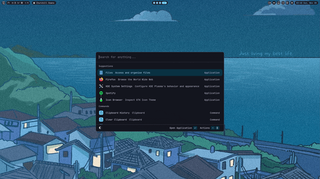
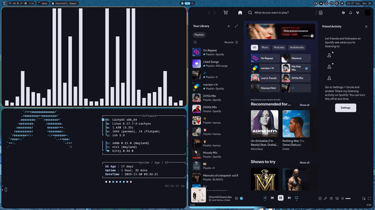

# Niri Blue Dotfiles

My current Niri Dotfiles that I use on my Linux machine!

I already made a Reddit post on r/unixporn (https://www.reddit.com/r/unixporn/comments/1pa8dsg/niri_first_attempt_at_ricing/)

# Installing
Me personally, I would just drag and drop these files into the /config folder in your user directory. But, there are 3rd party tools, such as,

- dotfiles-installer (https://github.com/mylinuxforwork/dotfiles-installer)
- chezmoi (https://www.chezmoi.io/)
- Mackup (https://github.com/lra/mackup)

# Previews

## License

[MIT](https://choosealicense.com/licenses/mit/)

## Authors

- [@haychk](https://www.github.com/haychk)

## Support

For support, dm me on discord @haychk_
